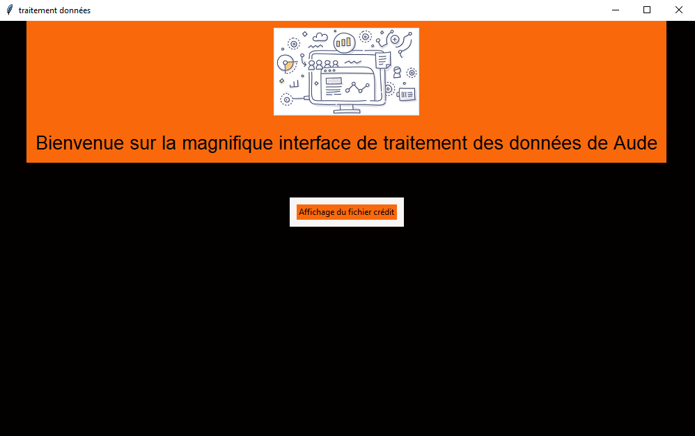
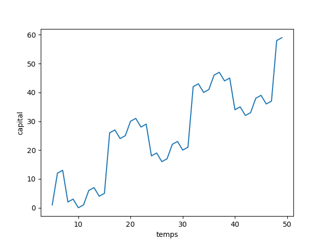

# traitement_donnees
Traitement, Visualisation et Analyse des données

Le fichier interface et main sont des embryons de l'interface graphique. L'interface se lance depuis le main

Les fichiers de travail sont les différents fichiers traitement et le fichier montant temps.

Ci-dessous le graphe de montant temps

